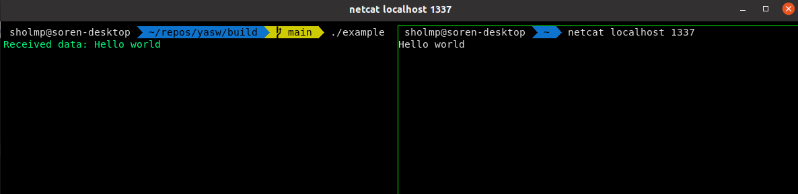

# Yet Another Socket Wrapper
A wrapper for UNIX sockets.

## Dependencies
[fmt formatting library](https://github.com/fmtlib/fmt) (only for example to run)

## Build
`mkdir build && cd build && cmake ../src && make`

